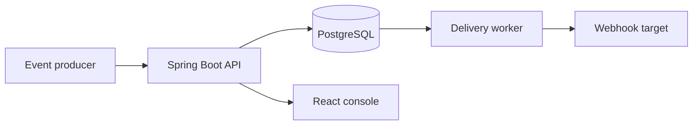
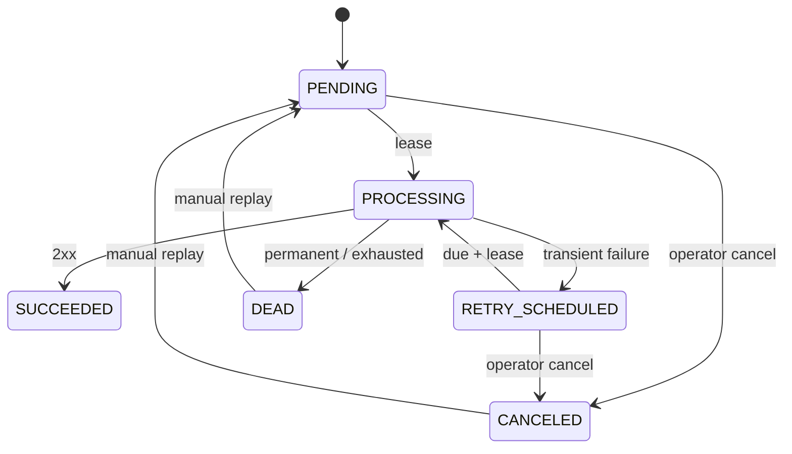

# Architecture / 架构说明

[English](#english) · [中文](#中文)

## English

### System context

The application is a modular monolith with one deployable backend and one static frontend. PostgreSQL owns the durable state transition. Network I/O happens outside database transactions.

### Modules

| Module | Responsibility |
| --- | --- |
| `endpoint` | Endpoint registration, versioned activation, URL policy, encrypted signing secret |
| `event` | Idempotent event acceptance and deterministic request body |
| `delivery` | Job lease, HTTP execution, retry policy, attempts, replay, SSE |
| `config` | Typed configuration, AES-GCM, HTTP client, clock |
| `common` | Request correlation and stable API error responses |

The `event` module calls the `DeliverySubmission` port that it owns; the `delivery` module provides the implementation. This keeps event acceptance independent from delivery internals and removes a package cycle. A Spring Modulith test verifies the dependency graph during every backend build.

### Acceptance flow

1. Lock the target endpoint row to serialize submissions for one endpoint.
2. Return the existing event and job when the idempotency key already exists.
3. Persist the immutable event body and `PENDING` delivery job in one transaction.
4. Return HTTP `202 Accepted` only after the transaction succeeds.

The unique `(endpoint_id, idempotency_key)` constraint is the final database guard.

### Worker and lease

Workers claim due jobs with `FOR UPDATE SKIP LOCKED`. The transaction only marks jobs as `PROCESSING`; the HTTP request executes after commit. A worker that crashes can leave a lease behind, so later polls reclaim jobs older than the configured lease timeout.

Each process uses virtual threads behind a semaphore-based concurrency limit. A polling cycle claims no more jobs than the currently available permits, preventing queued-but-not-started requests from consuming leases. Every process must use a distinct worker ID, and configuration validation requires the lease timeout to exceed the HTTP request timeout.

This creates **at-least-once delivery**. A target may receive a duplicate if the request succeeds but the worker crashes before persisting the outcome. Consumers use `X-Webhook-Id` as their idempotency key.

### Failure classification

| Result | Transition |
| --- | --- |
| HTTP 2xx | `SUCCEEDED` |
| HTTP 408, 429, or 5xx | retry with exponential backoff |
| Network error or timeout | retry with exponential backoff |
| Other HTTP status | `DEAD` |
| Retry budget exhausted | `DEAD` |

Each attempt stores the status code, bounded response excerpt, duration, timestamps, and classified error. The signing secret and request signature are never stored in attempt records.

### Diagnostics and telemetry

`GET /api/deliveries/{deliveryId}` returns the delivery summary and its attempts in chronological order. The projection deliberately excludes the event body, signing secret, and generated signature while retaining the bounded response excerpt and classified error needed for diagnosis.

An attempt-completed application event is published inside the outcome transaction. Micrometer counters, duration timers, and the structured completion log consume it with an `AFTER_COMMIT` listener. A rolled-back outcome therefore cannot appear as a completed attempt in runtime telemetry.

Every durable delivery-state transition also publishes a bounded internal event containing only the job ID, previous state, target state, and a fixed source. SSE delivery and manual replay/cancel audit logs consume these events with `AFTER_COMMIT` listeners. A client refresh triggered by SSE therefore observes committed state, and a rolled-back transition produces neither an operator audit record nor a phantom UI update.

Queue-health metrics use a periodically refreshed immutable snapshot rather than querying PostgreSQL for every Prometheus scrape. A grouped status query supplies the fixed `status` series, while the oldest-runnable age includes both due queued jobs and expired worker leases. Metric tags are deliberately limited to lifecycle status and attempt outcome; Endpoint IDs, delivery IDs, event types, URLs, payloads, and idempotency keys are excluded. The Compose observability profile binds Prometheus to localhost, and production management endpoints belong on a private operations network.

The demo receiver exposes `/hooks/flaky?failures=N` for a bounded, deterministic transient-failure scenario. It verifies the signature before injecting HTTP `503` responses and succeeds after the configured failure budget, allowing the same retry path to be inspected without an external service.

### Consistency decisions

- Event body is rendered once and reused byte-for-byte across attempts.
- Endpoint secrets are encrypted before persistence and decrypted only for delivery.
- Endpoint activation changes require the version last observed by the operator; stale writes return HTTP `409`.
- Deactivation blocks new event acceptance while already accepted delivery jobs continue under the existing immutable-event contract.
- Cancellation locks the delivery row before checking state. This serializes with worker `SKIP LOCKED` claims: only `PENDING` and `RETRY_SCHEDULED` can become `CANCELED`, and repeated cancellation is idempotent.
- A manual replay extends the attempt budget without resetting the historical attempt sequence.
- Database time is stored as UTC `timestamptz`; application time comes from an injected `Clock`.
- Frontend updates use commit-consistent SSE, while a manual refresh remains available as a recovery path.

## 中文

### 系统上下文

系统采用一个可部署后端与一个静态前端组成的模块化单体。PostgreSQL 管理持久化状态转换，网络请求在数据库事务之外执行。

### 模块职责

| 模块 | 职责 |
| --- | --- |
| `endpoint` | Endpoint 注册、带版本的启停控制、URL 策略和加密签名密钥 |
| `event` | 幂等事件接收与确定性请求体生成 |
| `delivery` | 任务租约、HTTP 投递、重试、尝试记录、重投和 SSE |
| `config` | 类型化配置、AES-GCM、HTTP Client 与时间源 |
| `common` | 请求关联 ID 和稳定 API 错误结构 |

`event` 模块调用自身定义的 `DeliverySubmission` 端口，`delivery` 模块提供实现。这样事件接收不依赖投递内部实现，也避免了包级循环依赖；每次后端构建都会通过 Spring Modulith 测试验证依赖图。

### 事件接收流程

1. 锁定目标 Endpoint 行，对同一 Endpoint 的事件提交进行串行化。
2. 幂等键已存在时返回原事件与投递任务。
3. 在同一个事务中保存不可变事件体和 `PENDING` 任务。
4. 事务成功后返回 HTTP `202 Accepted`。

数据库唯一约束 `(endpoint_id, idempotency_key)` 是最终一致性保护。

### Worker 与任务租约

Worker 使用 `FOR UPDATE SKIP LOCKED` 抢占到期任务。事务只负责将任务更新为 `PROCESSING`，提交后才执行 HTTP 请求。Worker 异常退出可能遗留租约，后续轮询会重新获取超过租约时间的任务。

每个进程使用虚拟线程执行请求，并通过 Semaphore 限制并发。每次轮询只抢占当前可用并发许可对应的任务，避免尚未开始的请求提前消耗租约。不同进程必须配置不同 Worker ID，配置校验也会要求租约超时长于 HTTP 请求超时。

系统提供 **at-least-once** 投递语义。如果目标已成功处理请求，而 Worker 在记录结果前退出，目标可能再次收到相同事件。接收方可以使用 `X-Webhook-Id` 实现幂等处理。

### 故障分类

| 结果 | 状态转换 |
| --- | --- |
| HTTP 2xx | `SUCCEEDED` |
| HTTP 408、429 或 5xx | 指数退避后重试 |
| 网络错误或超时 | 指数退避后重试 |
| 其他 HTTP 状态 | `DEAD` |
| 重试次数耗尽 | `DEAD` |

每次尝试记录状态码、有限长度响应摘要、耗时、时间和错误分类。签名密钥与请求签名不会写入尝试记录。

### 诊断与遥测

`GET /api/deliveries/{deliveryId}` 按时间顺序返回任务摘要及其投递尝试。该投影不会暴露事件体、签名密钥或生成后的签名，只保留诊断所需的有限响应摘要与错误分类。

结果事务内部会发布“尝试完成”应用事件，Micrometer 计数、耗时指标与结构化完成日志通过 `AFTER_COMMIT` Listener 消费该事件。因此，事务回滚的结果不会被错误记录为已经完成的运行时遥测。

每次持久化任务状态转换还会发布一个有界内部事件，只包含任务 ID、前一状态、目标状态和固定来源。SSE 通知以及人工重投/取消审计日志通过 `AFTER_COMMIT` Listener 消费这些事件。因此，SSE 触发的客户端刷新只能观察到已提交状态，回滚转换既不会形成操作审计记录，也不会产生虚假的界面更新。

队列健康指标使用定期刷新的不可变快照，而不是在每次 Prometheus 抓取时查询 PostgreSQL。分组状态查询生成固定的 `status` 序列，最老可运行任务年龄同时覆盖已到期排队任务与已过期 Worker 租约。指标标签只允许生命周期状态和尝试结果，明确排除 Endpoint ID、投递 ID、事件类型、URL、载荷及幂等键。Compose 可观测性 Profile 只在本机绑定 Prometheus，生产管理端点必须位于私有运维网络。

演示 Receiver 提供 `/hooks/flaky?failures=N`，用于制造有上限、可重复的瞬时故障。它会先验证签名，再按配置返回 HTTP `503`，耗尽失败预算后恢复成功，从而无需外部服务即可审查同一条重试链路。

### Endpoint 生命周期一致性

- Endpoint 启停变更必须携带运维端最后观察到的版本；陈旧写入返回 HTTP `409`。
- 停用会阻止接收新事件，已经接收的投递任务仍按现有不可变事件契约继续执行。
- 取消操作会先锁定任务行再检查状态，并与 Worker 的 `SKIP LOCKED` 抢占互斥；只有 `PENDING` 与 `RETRY_SCHEDULED` 可进入 `CANCELED`，重复取消保持幂等。
- 状态变更日志仅在事务提交后产生，回滚操作不会形成已完成的运行证据。
